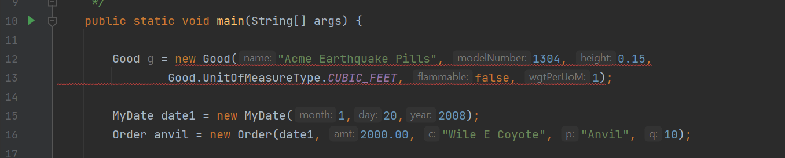

# Java-Abstract-Lab-Section-12

## Step 1: Abstract Good

Currently, the Good class allows instances of a Good to be created. In actuality, this
class serves as a template for the subclasses (Solid and Liquid), so instances of a
Good should not be created. For instance, consider the volume method on Good.
What is the volume of such a nebulous object?

### 1.1 Make Good abstract. In the Package Explorer view, double-click on the Good.java file in the com.acme.domain package to open the file in a Java editor. Use the “abstract” key word to make this class abstract.

```java
public abstract class Good {
...
}
```

### 1.2 Make the volume( ) method abstract in Good. Remove the current implementation of the volume( ) method in Good, and replace it with an abstract definition (see below). Making this method abstract forces the Solid and Liquid classes to implement and override volume( ).

```java
public abstract double volume();
```

### 1.3 Save Good.java and run the TestOrders.java file to ensure your application still works the same way.

### 1.4 Try to create an instance of Good.

1.4.1 In the main method of TestOrders.java, try to create an instance of the now
abstract Good.
```java
Good g = new Good("Acme Earthquake Pills", 1304, 0.15,
UnitOfMeasureType.CUBIC_FEET, false, 1);
```
1.4.2 This will also require you import the Good class.
```java
import com.acme.domain.Good;
```
1.4.3 You should get a compiler error that prevents an instance of Good from
being created.



1.4.4 Remove these two lines of code from TestOrders.java.

## Step 2: Creating Services

In addition to its goods, like any large conglomerate, Acme also offers a number of
services, such as Road Runner Eradication and Rocket Sled Assembly. An order can
then be placed for a good or a service. In this step, you create a new Service class
and an interface that both Goods and Services implement.

### 2.1 Create the Service Class. In the Package Explorer view, right-click on the com.acme.domain package in the AcmeOrderSystem project, and select New > Java Class.

### 2.2 In the New Java Class window, enter Service as the new class name, and click the Finish button.

The Service class should not extend any class other than java.lang.Object.

### 2.3 In the Service.java editor view, add name, estimatedTaskDuration, and timeAndMaterial fields.

```java
private String name;
private int estimatedTaskDuration;
private boolean timeAndMaterials;
```

### 2.4 Properly encapsulate these properties by generating public getter and setter methods for each.

### 2.5 Add a constructor to create a Service.

```java
public Service(String n, int dur, boolean tAndM) {
 this.estimatedTaskDuration = dur;
 this.name = n;
 this.timeAndMaterials = tAndM;
}
```

### 2.6 Add a toString( ) method to Service. The toString( ) method for a Service should display the name and estimated duration for a Service.

```java
public String toString() {
 return name + "(a " + estimatedTaskDuration + " day service)";
}
```

### 2.7 Save the Service.java file once you have finished coding, and ensure there are no compiler errors.

## Step 3: Creating Product

Unfortunately, a Service is not a descendant of the abstract Good class. Therefore,
an instance cannot be used as the “product” on an Order. To solve this, a new
interface, Product, is created, which both Goods and Services can implement.

### 3.1 Create the Product interface. In the Package Explorer view, right-click on the com.acme.domain package in the AcmeOrderSystem project, and select New > Java Class.

### 3.2 In the window that pops up, enter Product as the new interface name, then select Interface from the list, then press Enter.

### 3.3 Add the abstract methods. In the Product.java editor view, add the three common methods shared by all types of products.

3.3.1 All products (either goods or services) have a product name. Therefore,
create getName( ) and setName( ) abstract methods in the new interface.

```java
public abstract String getName();
public abstract void setName(String n);
```

3.3.2 All products also have a toString( ) method. Therefore, create the toString( )
abstract method in the new interface.

```java
public abstract String toString();
```

### 3.4 Save the Product.java interface, and make sure there are no compiler errors.

### 3.5 Modify Good and Service to implement the new Product interface. 

3.5.1 Open the Good.java and Service.java files in editor views.

3.5.2 Use the “implements” key word on both of these classes to signal to the
compiler that all Good and Service must provide the getName( ), setName( ), and
toString( ) methods. The change to Good is shown below. Do the same work in
Service.

```java
public abstract class Good implements Product {
...
}
```

Note: Why do Solid and Liquid not have to use the “implements” keyword in their
class definitions? These classes also must implement the Product interface, as they
extend Good, which implements Product.

3.5.3 Since these classes already provide the three abstract methods of Product,
no further work is required. Save Product, Good, and Service, and make sure there
are no compiler errors.

## Step 4: Refactor Order (again)

Through the power of polymorphism, orders currently allow any type of Good to be
created and associated with an order through the product field. However, an order
may be for a service as well. As a Service is not a type of Good, the Order class must
be modified to allow for any Product type.

### 4.1 Change the product field’s type. In Order.java, change the type of product from Good to Product.

```java
private Product product;
```

### 4.2 Update the getter/setter. Modify the getter and setter method for product in the Order class to get and set a Product, rather than a Good. The code for the new getter method is shown below. Note: This will cause compiler errors in Order.

```java
public Product getProduct() {
 return product;
}
```

### 4.3 Change the Order constructor to use a Product, rather than a Good, when creating an Order.

```java
public Order(MyDate d, double amt, String c, Product p, int q)
{
orderDate = d;
orderAmount = amt;
customer = c;
product = p;
quantity = q;
}
```

### 4.4 Save your changes to Order, and then test the new Order class that uses the Product interface. Run TestOrders and check the output. The output should not change.
```java
Attempting to set the quantity to a value less than or equal to
zero
10 ea. Acme Anvil-1668 that is 0.0225 CUBIC_METER in size for
Wile E Coyote
125 ea. Acme Balloon-1401 that is 375.0 CUBIC_FEET in size for
Bugs Bunny
The tax Rate is currently: 0.05
The tax for 3000.0 is: 150.0
The tax for this order is: 100.0
The tax for this order is: 50.0
The tax Rate is currently: 0.06
The tax for 3000.0 is: 180.0
The tax for this order is: 120.0
The tax for this order is: 60.0
The total bill for: 10 ea. Acme Anvil-1668 that is 0.0225
CUBIC_METER in size for Wile E Coyote is 2000.0
The tax for this order is: 60.0
The total bill for: 125 ea. Acme Balloon-1401 that is 375.0
CUBIC_FEET in size for Bugs Bunny is 1040.0
```

### Step 5: Create Orders with Service

Because Services share the same interface (Product) as Goods, you should be able to create Orders with Service objects as the “product” without requiring other changes.

## 5.1 Add an import statement. In TestOrders, add an import statement so that the class can use the new Service objects.

```java
import com.acme.domain.Service;
```
## 5.2 Create an Order with a service. In TestOrders, add the following lines of code at the end of the main( ) method.

```java
MyDate date3 = new MyDate(4,10,2008);
Service s3 = new Service("Road Runner Eradication", 14, false);
Order birdEradication = new Order(date3, 20000, "Daffy Duck",
s3, 1);
System.out.println("The total bill for: " + birdEradication + " is "
+ birdEradication.computeTotal());
```

## 5.3 Save the file, and make sure there are no compiler errors in your code. Run TestOrders, and make sure that an Order associated with a Service works the same as an Order associated with a Good.

```java
Attempting to set the quantity to a value less than or equal to
zero
10 ea. Acme Anvil-1668 that is 0.0225 CUBIC_METER in size for
Wile E Coyote
125 ea. Acme Balloon-1401 that is 375.0 CUBIC_FEET in size for
Bugs Bunny
The tax Rate is currently: 0.05
The tax for 3000.0 is: 150.0
The tax for this order is: 100.0
The tax for this order is: 50.0
The tax Rate is currently: 0.06
The tax for 3000.0 is: 180.0
The tax for this order is: 120.0
The tax for this order is: 60.0
The total bill for: 10 ea. Acme Anvil-1668 that is 0.0225
CUBIC_METER in size for Wile E Coyote is 2000.0
The tax for this order is: 60.0
```

Because both Service and Good objects share the same interface, they can
be used interchangeably (to some extent) with Orders. This is
polymorphism through interfaces!
